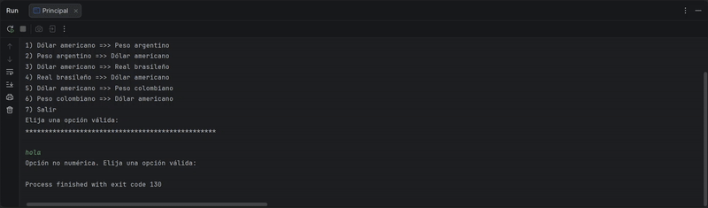

# Challenge 2: Conversor de Monedas


 

 

## Introducción

El programa [Oracle Next Education (ONE)](https://www.oracle.com/latam/education/oracle-next-education/) es un programa de educación, inclusión y empleabilidad que forma a personas en tecnología y las conecta con el mercado laboral con el apoyo de empresas asociadas.

Es un programa gratuito que dura 12 meses. Abre inscripciones 2 veces al año donde las personas pueden postular mediante un formulario. Cada generación es enumerada con números arábigos.

El proyecto Conversor de Monedas es el Challenge 2 del programa ONE de Oracle y Alura Latam del grupo G9 que inició en julio 2025. Es el primer reto de desarrollo de la fase 3 (para estudiantes admitidos en el programa) y segundo reto entre todas las fases después del aprendizaje de los cursos de desarrollo en Java, Orientación a Objetos, consumo de APIs y manejo de Excepciones.

El reto tiene como finalidad poner a prueba a los estudiantes en 2 puntos: programación Orientada a Objetos en Java y uso de Git y GitHub.

## Descripción del proyecto

Conversor de Monedas es una aplicación de Escritorio para realizar conversión de valores de una moneda a otra usando la API [ExchangeRate](https://www.exchangerate-api.com/). Elige la opción deseada para seleccionar las monedas origen y destino, ingresa el monto a convertir y el aplicativo arrojará el monto resultante.

## Estado del proyecto

El día 07 de febrero del 2026 se lanzó la versión 1 del proyecto empleando el mismo diseño del menú mostrado en el video instructivo.

El proyecto se encuentra en su [versión 1.0](#registro-de-cambios).

## Demostración de funcionalidad

El aplicativo imprime el menú de opciones de monedas origen y destino, para que el usuario ingrese el número de opción que se valida hasta registrar un número de opción válido, del mismo modo, el sistema solicita el ingreso de un valor que se valida porque debe ser un monto igual o mayor a cero. El sistema arrojará un mensaje indicando el monto y moneda origen, y el monto y moneda destino.



## Instalación local

1. Clona el código fuente.

```
git clone https://github.com/PolloRosa/Challenge2-ConversorDeMonedas.git
```

O descarga el proyecto haciendo click en el botón verde "Code" y haciendo click en la opción "Download ZIP".

2. Iniciar el IDE IntelliJ IDEA y abrir el proyecto.

3. Crear una cuenta en la página web de ExchangeRate-API, y colocar el API KEY en la constante `API_KEY` en la clase `Constantes` en el paquete `com.pollorosa.convermonedas.modelo`.

4. Configurar las monedas disponibles para la conversión, en la variable `monedas` en la clase ejecutable `Principal` en el paquete `com.pollorosa.convermonedas.vista`.

5. Ejecutar la clase `Principal` presente en el paquete `com.pollorosa.convermonedas.vista`.

## Tecnologías usadas

* JDK 17.0.13
* IntelliJ IDEA 2025.3.1
* Librería [Gson](https://mvnrepository.com/artifact/com.google.code.gson/gson)
* [ExchangeRate-API](https://www.exchangerate-api.com/)
* Git para control de versiones

## Registro de cambios

1.1 *08 febrero 2026*

* :pencil2: Correcciones menores en el README.md.

1.0 *08 febrero 2026*

* :sparkles: Fusión de ramas desarrollo y main.
* :sparkles: Creación del archivo README.md.

0.3.0 *07 febrero 2026*

* :pencil2: Agrega más constantes en la clase Constantes para manejar los códigos de error en el API ExchangeRate y la API KEY.
* :pencil2: Corrección en la clase Exchangerate para manejar la conversión con el API ExchangeRate y la conversión de la respuesta json al record ResponseConversor.
* :sparkles: Creación del record ResponseConversor para recibir información de la consulta al API ExchangeRate.
* :sparkles: Creación de la clase ExchangerateException para manejar los errores que el API ExchangeRate puede retornar con código y mensaje.
* :sparkles: Creación de la clase ExchangerateError para registrar y listar todos los códigos y mensajes de error que el API ExchangeRate puede retornar.
* :pencil2: Agregar el método para realizar la conversión de monedas con la clase Exchangerate, en la clase Aplicativo.

0.2.0 *07 febrero 2026*

* :sparkles: Agrega la clase Constantes para todas las constantes: textos a imprimirse en pantalla para el menu y los mensajes de error a ser usados en las validaciones.
* :sparkles: Agrega la clase Moneda para ser usada para la configuración de monedas disponibles para la conversión.
* :sparkles: Agrega la clase Opcion para manejar el menú como una lista de opciones. 
* :pencil2: La clase Conversor cambia de nombre a Aplicativo, para manejar el funcionamiento de todo el aplicativo.

0.1.0 *06 febrero 2026*

* :white_check_mark: Crea las clases base para la conexión con el API ExchangeRate.
* Crea la clase Exchangerate para administrar la conexión con el API ExchangeRate.
* Crea la clase Conversor para manejar la funcionalidad de la conversión de monedas.

## Autor

Angela Cáceres @PolloRosa :baby_chick:

## Licencia

El proyecto está bajo la licencia MIT. Puedes usarlo, compartirlo y modificarlo libremente, incluso con fines comerciales. La única condición es que conserves el aviso de derechos de autor original y el texto de la licencia en todas las copias o partes sustanciales del software. 